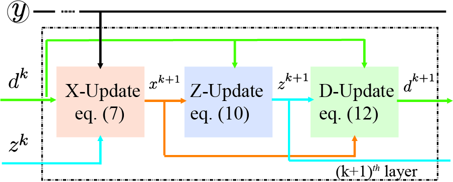

# UADMM-Net



 an Tensorflow Implementation of conference paper:
 > C. Zhou and M. R. D. Rodrigues, "An ADMM Based Network for Hyperspectral Unmixing Tasks," ICASSP 2021 - 2021 IEEE International Conference on Acoustics, Speech and Signal Processing (ICASSP), Toronto, ON, Canada, 2021, pp. 1870-1874, doi: 10.1109/ICASSP39728.2021.9414555.

and its journal article
> C. Zhou and M. R. D. Rodrigues, "ADMM-Based Hyperspectral Unmixing Networks for Abundance and Endmember Estimation," in IEEE Transactions on Geoscience and Remote Sensing, vol. 60, pp. 1-18, 2022, Art no. 5520018, doi: 10.1109/TGRS.2021.3136336.

Note that the results may be slightly different from what is reported in the manuscript as the training processis stochastic.
## Dependencies
```
  - tensorflow-gpu==2.5.0
  - scipy=1.5.3=py36h81d768a_1
```
## Usage
- Run "train_UADMMAENet.py" for abundance estimation case.
- Run "train_UADMMBUNet.py" for blind unmixing case.


## Citation
If you find this code is helpful to you, please cite the following:
```
@inproceedings{zhou2021admm,
  title={An admm based network for hyperspectral unmixing tasks},
  author={Zhou, Chao and Rodrigues, Miguel RD},
  booktitle={ICASSP 2021-2021 IEEE International Conference on Acoustics, Speech and Signal Processing (ICASSP)},
  pages={1870--1874},
  year={2021},
  organization={IEEE}
}

@ARTICLE{9654204,
  author={Zhou, Chao and Rodrigues, Miguel R. D.},
  journal={IEEE Transactions on Geoscience and Remote Sensing}, 
  title={ADMM-Based Hyperspectral Unmixing Networks for Abundance and Endmember Estimation}, 
  year={2022},
  volume={60},
  number={},
  pages={1-18},
  doi={10.1109/TGRS.2021.3136336}
  }
```


